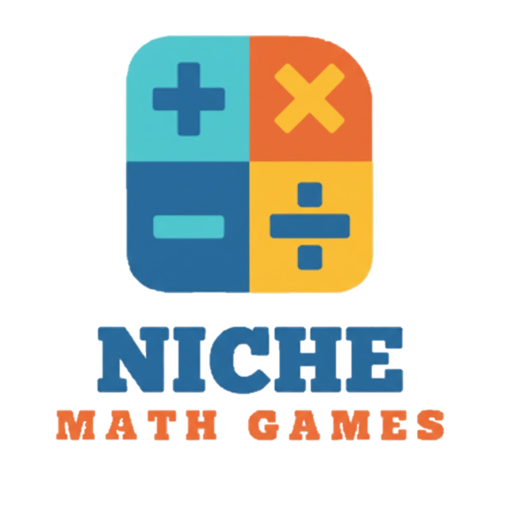

# Niche Math Games
 
## 📚 Table of Contents
- [About the Project](#-about-the-project)
- [Features](#-features)
- [Used Technologies](#-used-technologies)
- [Download](#-download)
- [Contributors](#-contributors)
 
---
 
## 📘 About the Project
**Niche Math Games** is a lightweight and fun math quiz game designed to help users practice basic arithmetic at three difficulty levels: **Easy**, **Medium**, and **Hard**.
 
It’s perfect for students, casual learners, or anyone who wants to sharpen their mental math skills.
 
---
 
## 🎮 Features
 
✔ **Three Difficulty Levels**
- Easy – simple addition and subtraction  
- Medium – mixed operations with higher numbers  
- Hard – more challenging equations and trickier combinations  
 
✔ Randomly generated questions  
✔ Score tracking  
✔ Clean and simple user experience  
 
---
 
## 🛠 Used Technologies

### Software & Tools  
<div>

 Visual Studio 2022
<br>

 GitHub
<br>

 MS Word
<br>

 MS PowerPoint
<br>

 MS Teams

</div>

### Programming Language  
<div>

 C++

</div>
 
---
 
## 📥 Download
 
To clone the repository:
 
```bash
git clone https://github.com/codingburgas/sprint-math-games-9th-grade-niche-math-games.git
```
 
## 👥 Contributors
 
<table>
<tr>
<td align="center">
<a href="https://github.com/Altay-Yemendzhiev">
<br>
<sub><b>Алтай Йеменджиев</b></sub>
</a>
</td>
<td align="center">
<a href="https://github.com/MGIliev24">
<br>
<sub><b>Мирослав Илиев</b></sub>
</a>
</td>
<td align="center">
<a href="https://github.com/RRIvanchev24">
<br>
<sub><b>Ростислав Иванчев</b></sub>
</a>
</td>
<td align="center">
<a href="https://github.com/Ivantr77">
<br>
<sub><b>Иван Трифонов</b></sub>
</a>
</td>
</tr>
</table>
 
---
 
### 🎯 Project Roles
 
- **Алтай Йеменджиев** – *Scrum Trainer*  
- **Мирослав Илиев** – *Back-End Developer*  
- **Ростислав Иванчев** – *Front-End Developer*  
- **Иван Трифонов** – *Designer*
 
